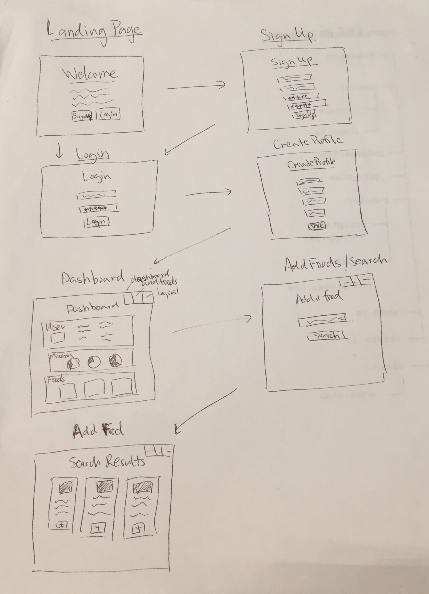

# Burn

### SEI 7 - Project 2 - Django

### Welcome to Burn!

#### Description:
This project is a nutrition app in which users can track their daily intake of calories, fats, carbs, and protein. 
Unlike other nutrition apps, Burn tracks your nutritional intake via an external api called Nutronix. All you have to do is input the food you ate and when you ate it, and we handle all the rest!

#### Wireframe:

#### User stories:
On page load, the user is greeted with a welcome page with a brief introductory message and buttons to sign up or login. The user clicks on the sign up button to register their account and is redirected to the login page. When the user logs in, they are redirected to a create profile page to enter their body metrics and fitness goals; If the user already has a profile, they are taken directly to the main dashboard. The app makes macro calculations based on the user input data.
At the dashboard page they can view (via progress bars) how close they are to their daily goal. The dashboard page also includes a reset button to clear all foods at the start of a new day. The nav buttons on the page allow them to logout, add foods to their meals and snacks, or go back to the dashboard. To add a food, the user clicks on the 'add foods' button, taking them to a search form. The user searches for the food that they ate and a card pops up displaying the foods' macros. The user then enters when they ate that food and hits 'log this food' to add it to their profile. 

#### Link to Heroku hosted project: https://projectburn.herokuapp.com/

#### Technologies (languages, external libraries, APIs):
* Python
* Django
* PostgreSQL
* Bootstrap
* JQuery
* Ajax
* Nutronix API
* Favicon
* AwesomeFonts

#### Wish List / Future Development:
UI changes, 
tracking weekly and monthly goals over time, 
automatic daily reset on goals and foods eaten.

#### Contributors (with links to their GitHub profiles):
* Billy: https://github.com/billy-zeng
* Ryan: https://github.com/ryansherring
* Sai: https://github.com/saiguy1
